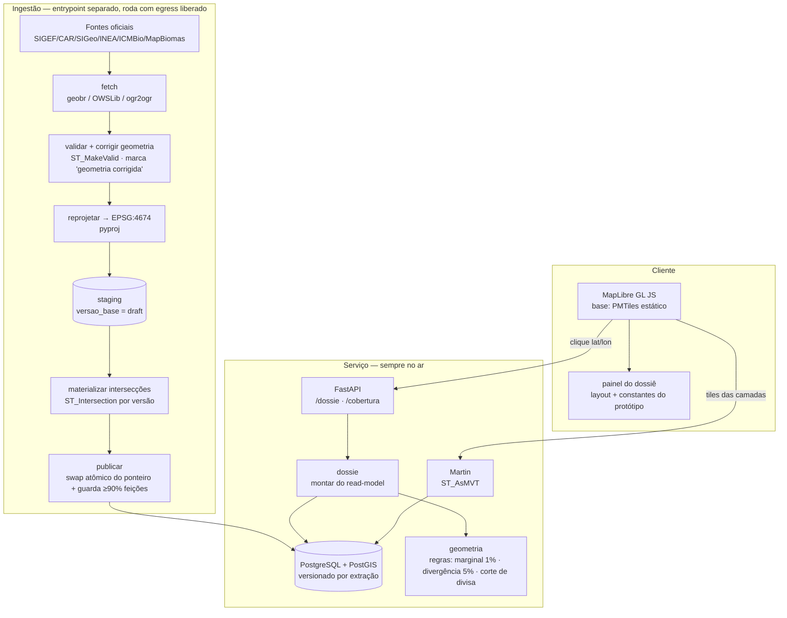

# Dossiê de Lote RJ — Design

**Spec**: `.specs/features/dossie-lote-rj/spec.md`
**Context**: `.specs/features/dossie-lote-rj/context.md`
**Status**: Draft
**Traction mode**: MVP — Fase 1 existe para provar ou refutar a tese, não para escalar. O design
fica no menor formato que ainda mantém as promessas do produto verdadeiras por construção.

**Escopo desta fase**: P1 do spec (DOS-01..13) + regras de geometria/divisa e versionamento
(DOS-25, 26, 28, 29, 30). O gate jurídico (P2, DOS-20..22) entra como **fronteira reservada, vazia**;
exportação PDF (P2) e polígono próprio (P3) ficam fora.

---

## Architecture Overview

Monolito Python (FastAPI), organizado por domínio, com **ingestão como entrypoint separado no
mesmo repo** (roda onde há egress `.gov.br`). O coração é um **read-model materializado por versão
de base**: as intersecções lote × restrição são calculadas **na ingestão**, não por consulta.
Assim um clique vira leitura barata (point-in-polygon + leitura de cruzamentos pré-computados),
e as promessas de latência (DOS-03), idempotência (DOS-26) e troca atômica de versão (DOS-28)
valem por construção, não por esforço em tempo de request.



---

## Code Reuse Analysis

### Existing Components to Leverage

| Component | Location | How to Use |
| --- | --- | --- |
| Regras de produto do protótipo (marginal <1%, divergência >5%, cobertura declarada, ordem do dossiê) | `prototipos/mapa-dossie/index.html` | **Referência**, não import: as constantes e a lógica de negócio migram para o módulo `geometria` (server) e para o painel MapLibre (client) |
| Layout do dossiê e proveniência por campo | `prototipos/mapa-dossie/index.html` + `docs/produto/dossie.md` | Referência de UI para o painel do front-end |
| Stack por camada já levantada | `docs/research/stack-open-source.md` | Fonte das escolhas de biblioteca (geobr, PostGIS, MapLibre, PMTiles, Martin) |
| Gates determinísticos do spec-driven | `.claude/skills/tlc-spec-driven/scripts/*.py` | Validação de spec/tasks/commit/state por fase |

> **Aviso sobre a matemática do protótipo:** shoelace planar e ray-casting do protótipo **não**
> servem para área geodésica na escala do RJ. Só as **regras/limiares e o layout** são reusados;
> área e intersecção reais vêm do PostGIS (`ST_Area` em geografia / projeção equivalente,
> `ST_Intersection`), nunca da matemática planar do protótipo.

### Integration Points

| System | Integration Method |
| --- | --- |
| Fontes oficiais `.gov.br` | Só na ingestão, com egress liberado (nunca no caminho de request — AD-004) |
| PostGIS | Read-model materializado; serviço lê, ingestão escreve versão nova e faz swap |
| Martin (tiles) | Lê as mesmas tabelas materializadas via `ST_AsMVT`; processo separado, sem lógica de negócio |
| PMTiles/Protomaps | Arquivo estático em CDN; base do mapa, imutável entre reingestões |

---

## Fatia 2 — Escopo desta rodada (walking skeleton)

O restante deste documento descreve a arquitetura completa do P1 (todas as fontes). A **Fatia 2**
implementa um recorte deliberadamente menor para provar o pipeline fim-a-fim antes de somar fontes:
**só SIGEF** (rural certificado). CAR, SIGeo (urbano) e as camadas de restrição (INEA/ICMBio/ANA)
ficam para fatias seguintes — sem eles, `intersecao_materializada` não tem o que cruzar, então essa
tabela **não é criada nesta fatia**.

**Entra na Fatia 2**: schema PostGIS mínimo (`versao_base`, `ponteiro_publicado`, `limite_estado`,
`lote_rural` com as duas colunas de geometria previstas no modelo canônico — `geom_car` fica nula
por enquanto —, `proveniencia`, `cobertura`), os adapters `RepositorioLotesPostGIS` e
`LimiteEstadoPostGIS` implementando os *ports* já existentes (T4/Fatia 1), e a ingestão de duas
fontes: o limite estadual do RJ (via geobr/IBGE, fetch programático) e o SIGEF (a partir de um
arquivo de export já baixado por ação humana — ver decisão abaixo).

**Decisão herdada de Fase 0, não revisitada aqui**: o SICAR e o SIGEF **não têm download
programático** — exigem login GOV.BR e (SICAR) captcha resolvidos por humano numa sessão de
navegador (ver `.specs/STATE.md`, Fase 0). Por isso `ingerir_sigef` recebe **um caminho de arquivo
já exportado**, não uma URL — a ingestão automatiza validação/reprojeção/publicação, não o
download em si. Isso não é uma decisão nova; é a Fase 0 se refletindo no contrato da função.

---

## Perspective Sweep (Complex)

- **Structure** — módulos por domínio (`ingestao`, `dossie`, `geometria`, `cobertura`,
  `proveniencia`, `persistencia`); API é entrypoint fino que orquestra. Regra de negócio nunca
  mora na rota.
- **Integration** — fonte externa só toca a ingestão (assíncrona, batch). O request do usuário
  nunca depende de portal do governo (AD-004). Camada faltante degrada o dossiê, não o derruba
  (DOS-11/12).
- **Data** — dupla geometria por imóvel rural (SIGEF certificado + CAR declaração), nunca uma
  "final" (AD-003). Proveniência (fonte + data) é coluna, não enfeite (AD-005). Versão de base é
  dimensão explícita; publicação é atômica (DOS-28).
- **Security** — MVP exige conta autenticada (para log de auditoria e medição), sem paywall.
  Nenhum dado pessoal de proprietário em nenhuma tabela (AD-002). O gate jurídico é fronteira
  reservada vazia; sua construção real é P2.
- **Infra & ops** — uma caixa para o MVP (API + PostGIS + Martin), PMTiles em CDN. Ingestão roda
  onde há egress. Reingestão mensal com data de extração carimbada por camada. Observabilidade:
  toda consulta logada (lote, usuário, camadas, latência — DOS-30).
- **Domain** — UF como dimensão explícita mesmo cobrindo só o RJ (AD-001), para federar depois
  sem redesenho. Vocabulário do `docs/produto/glossario.md` é o dos módulos e tabelas.

**Tensão resolvida:** *Data* quer materializar tudo por versão (rápido, idempotente); *Infra* quer
pouco armazenamento. Resolução: materializar só as intersecções (o caro), manter política de
retenção de N versões, e deixar o base map (imutável) fora do versionamento — em PMTiles estático.

---

## Components

### `ingestao` (entrypoint separado)
- **Purpose**: baixar, validar, reprojetar e materializar cada fonte em uma versão de base publicável.
- **Location**: `src/terrametrica/ingestao/`
- **Interfaces**:
  - `ingerir_camada(fonte: Fonte, versao: VersaoBase) -> RelatorioCamada` — baixa, valida, grava em staging
  - `materializar_intersecoes(versao: VersaoBase) -> None` — `ST_Intersection` lote × restrição, grava área+pct
  - `publicar_versao(versao: VersaoBase) -> ResultadoPublicacao` — guarda ≥90% de feições vs versão anterior (senão rejeita, DOS-25/edge) e faz swap atômico do ponteiro publicado (DOS-28)
- **Dependencies**: geobr, OWSLib, GDAL/`ogr2ogr`, GeoPandas+Shapely, pyproj, PostGIS
- **Reuses**: `docs/research/stack-open-source.md` (escolhas de lib); regras de correção `ST_MakeValid`

### `geometria` (regras puras)
- **Purpose**: encapsular os limiares e cálculos que definem o produto, sem I/O.
- **Location**: `src/terrametrica/geometria/`
- **Interfaces**:
  - `classificar_intersecao(area_lote, area_inter) -> {plena | marginal}` — <1% vira "toque marginal" (DOS-08/edge)
  - `avaliar_divergencia(area_sigef, area_car) -> Divergencia` — diferença ha + pct; alerta acima de 5% (DOS-17/18 são P2, mas a regra vive aqui)
  - `recortar_ao_estado(geom, limite_rj) -> geom` — imóvel que ultrapassa a divisa do RJ tem área só na porção interna (DOS-25/edge)
- **Dependencies**: nenhuma externa; opera sobre resultados do PostGIS
- **Reuses**: constantes e regras do protótipo (`prototipos/mapa-dossie/index.html`)

### `dossie` (montagem)
- **Purpose**: de uma coordenada de clique a um dossiê montado do read-model.
- **Location**: `src/terrametrica/dossie/`
- **Interfaces**:
  - `montar_dossie(coord: Coordenada, versao: VersaoBase) -> Dossie | SemLote | Sobreposicao | ForaDoRJ`
    - fora do RJ → recusa "apenas RJ" (DOS-02/05)
    - sem polígono → município + cobertura declarada (DOS-04)
    - sobreposição → lista imóveis e exige escolha (DOS-06)
    - camada faltante → dossiê parcial marcando a ausência (DOS-11/12)
    - carimba fonte + data por campo; marca camada >90 dias como "possivelmente desatualizada" (DOS-10/13)
- **Dependencies**: `geometria`, `persistencia`, `cobertura`, `proveniencia`
- **Reuses**: read-model materializado (leitura barata, sem `ST_Intersection` em request)

### `cobertura` (serviço + página pública)
- **Purpose**: por município × camada, se há dado e de qual data.
- **Location**: `src/terrametrica/cobertura/`
- **Interfaces**: `cobertura_por_municipio() -> list[CoberturaCamada]` — alimenta a página pública (DOS-13) e o estado "sem cobertura aqui" no dossiê (DOS-11)
- **Dependencies**: `persistencia`

### `proveniencia` (metadados de fonte)
- **Purpose**: manter fonte, data de extração e link oficial por camada/versão.
- **Location**: `src/terrametrica/proveniencia/`
- **Interfaces**: `carimbo(camada: Camada, versao: VersaoBase) -> Proveniencia` — usado por `dossie` em cada campo (DOS-10)
- **Dependencies**: `persistencia`

### `api` (entrypoint FastAPI, fino)
- **Purpose**: orquestrar; nenhuma regra de negócio.
- **Location**: `src/terrametrica/api/`
- **Interfaces**:
  - `GET /dossie?lat&lon&versao` → `dossie.montar_dossie`
  - `GET /cobertura` → `cobertura.cobertura_por_municipio`
  - registra cada consulta (lote, usuário, camadas, latência — DOS-30)
- **Dependencies**: `dossie`, `cobertura`, autenticação de conta (MVP: conta obrigatória, sem paywall)

### `web` (front-end MapLibre)
- **Purpose**: mapa "arrastável como Google Maps" + painel do dossiê.
- **Location**: `web/`
- **Interfaces**: MapLibre GL JS; base PMTiles estático; camadas via Martin (MVT); Turf.js para geometria leve
- **Reuses**: layout do dossiê e constantes de regra do protótipo

> **Fronteira reservada (não construída em P1):** gate jurídico — `conta.papel`, verificação de
> credencial e log imutável de auditoria (P2, DOS-20..22). O modelo de dados **reserva** o limite
> (papel na conta; seção proprietário = "indisponível nesta versão"), mas a lógica é P2.

---

## Data Models

> SIRGAS 2000 (EPSG:4674) para armazenamento; área calculada em projeção equivalente; 3857 só
> para tiles. Todas as tabelas carregam `versao_base_id` onde o dado muda por reingestão.

```sql
-- Dimensão de versão: publicação atômica troca o ponteiro (DOS-28)
versao_base(id, criada_em, status /* draft|published|retired */, feicoes_por_camada jsonb)
ponteiro_publicado(camada, versao_base_id)  -- swap atômico por transação

-- Imóvel rural: DUAS geometrias, nunca uma final (AD-003)
lote_rural(
  id, uf='33', municipios text[], codigo_sigef, denominacao, situacao_certificacao,
  geom_sigef geometry(MultiPolygon,4674),  -- limite certificado
  geom_car   geometry(MultiPolygon,4674),  -- declaração (pode ser null)
  geometria_corrigida bool,                -- marca correção na ingestão (edge)
  versao_base_id
)

lote_urbano(  -- só Niterói no MVP
  id, uf='33', municipio='Niterói', inscricao_cadastral, logradouro, numero, bairro,
  quadra, loteamento, geom geometry(MultiPolygon,4674),
  geometria_corrigida bool, versao_base_id
)

restricao(  -- APP | reserva_legal | uc | inundacao | deslizamento | corpo_dagua
  id, tipo, nome, categoria, grau_suscetibilidade,
  geom geometry(MultiPolygon,4674), versao_base_id
)

-- Read-model: o que faz o clique ser barato (materializado na ingestão)
intersecao_materializada(
  lote_id, lote_kind /* rural|urbano */, restricao_id, tipo_restricao,
  area_m2, pct_do_lote, marginal bool,     -- <1% => marginal (DOS-08)
  versao_base_id
)

proveniencia(camada, versao_base_id, fonte, data_extracao, link_oficial)  -- (DOS-10/05)
cobertura(municipio, camada, tem_dado bool, data_extracao)               -- (DOS-13)
consulta_log(id, ts, usuario_id, lote_id, camadas text[], latencia_ms)    -- (DOS-30)

-- Fronteira reservada, VAZIA no MVP (P2)
conta(id, email, papel /* consulta|habilitado_juridicamente */)  -- sem dado de proprietário
```

**Relationships**: `intersecao_materializada` liga `lote_*` a `restricao` por versão; `proveniencia`
e `cobertura` chaveiam por `(camada, versao_base_id)`; o serviço só lê a versão apontada por
`ponteiro_publicado`.

---

## Testing Seams — Fatia 2

| Seam (onde o teste se prende) | Existente ou Novo | O que um teste afirma através dele | Reusa |
| --- | --- | --- | --- |
| `RepositorioLotes` (Protocol, `dossie/portas.py`, T4) | Existente | `RepositorioLotesPostGIS` cumpre o mesmo contrato que o fake em memória (T5) — mesmos casos de borda, dado real no Postgres | Contrato já definido; casos de borda de `tests/fakes/repositorio_fake.py` |
| `LimiteEstado` (Protocol, `dossie/portas.py`, T4) | Existente | `LimiteEstadoPostGIS.contem` concorda com os testes de fronteira do RJ já usados em T2/T5 | Mesmas coordenadas de teste (dentro/fora/limite) |
| Container PostGIS efêmero (testcontainers) | **Novo** | Toda asserção de schema, adapter e publicação atômica roda contra Postgres+PostGIS real, não mock | Nenhuma alternativa razoável — `ST_Intersection`/`ST_MakeValid`/swap atômico são comportamento do banco, não emulável em SQLite/fake |
| `ingerir_sigef(caminho, versao)` — assinatura de função | **Novo** | Validação + reprojeção + staging a partir de um arquivo local (não de rede) | Fixture `.shp` sintética com os mesmos campos reais descobertos em Fase 0 (`municipio_`, `status`) |

> Container efêmero é seam novo porque não havia nenhuma infraestrutura de teste além de `pytest`
> unit puro (Fatia 1, sem I/O). Justificativa: é a única forma de testar comportamento específico do
> PostGIS sem reescrever a lógica espacial em Python só para viabilizar teste — isso violaria "reuse
> before invent" na direção contrária (inventar uma segunda implementação só para ser testável).

---

## Error Handling Strategy

| Error Scenario | Handling | User Impact |
| --- | --- | --- |
| Coordenada fora do RJ | `dossie` recusa antes de consultar | "fora da área de cobertura: apenas RJ" (DOS-05) |
| Clique sem polígono | Devolve município + cobertura declarada | "sem lote mapeado neste ponto" + cobertura (DOS-04) |
| Sobreposição de polígonos | Lista todos, exige escolha antes de montar | Usuário escolhe o imóvel (DOS-06) |
| Camada indisponível no momento | Entrega dossiê parcial marcando a faltante | Seção marcada "indisponível no momento" (DOS-12) |
| Camada sem cobertura no município | Seção aparece declarando ausência | "camada não disponível neste município" (DOS-11) |
| Geometria inválida na fonte | `ST_MakeValid` na ingestão, marca o registro | "geometria corrigida na ingestão" (edge) |
| Base extraída há >90 dias | Marca camada no dossiê | "possivelmente desatualizada" (DOS-13) |
| Reingestão com <90% das feições | Rejeita a publicação, mantém a anterior | Usuário segue vendo a versão válida (DOS-25/edge) |

---

## Risks & Concerns

| Concern | Location | Impact | Mitigation |
| --- | --- | --- | --- |
| Fase 0 não verificada: SIGeo pode expor só quadra, não lote; CRS não confirmado | `docs/research/fontes-de-dados-rj.md:89` | Camada urbana pode não existir na granularidade prometida | Camada urbana fica atrás de `cobertura` declarada; CRS é config, área é calculada em projeção equivalente independente do SRID de storage; ingestão **mede antes de publicar** |
| Matemática planar do protótipo não vale para área geodésica na escala do RJ | `prototipos/mapa-dossie/index.html:420` | Área/perímetro errados se reusar o cálculo | Produção usa PostGIS (`ST_Area` geografia / projeção equivalente); só limiares e layout são reusados |
| Crescimento de armazenamento do read-model por versão | (data model) | Custo de disco cresce a cada reingestão | Política de retenção de N versões; base map imutável fora do versionamento (PMTiles) |
| Projeto greenfield sem infra de teste | (repo) | Sem rede de segurança para as regras de geometria | Fase Tasks instala pytest + fixtures espaciais antes de qualquer código de regra |
| Egress `.gov.br` bloqueado no ambiente remoto | `docs/DEV-SETUP.md:36` | Ingestão não roda aqui | Ingestão é entrypoint separado, rodável onde há egress; serviço não depende dela em request |
| SIGEF/CAR não têm download programático (login GOV.BR + captcha, ver Fase 0) | `.specs/STATE.md` (Fase 0) | `ingerir_sigef` não pode buscar a fonte sozinho | Recebe caminho de arquivo já exportado por ação humana periódica; documentado como pendência operacional recorrente, não bug |
| Testes de integração exigem Docker rodando localmente (testcontainers) | (Fatia 2, novo) | Suíte de integração falha silenciosamente sem Docker | `Done when` de cada task de integração inclui checar `docker info` antes; documentar em `docs/DEV-SETUP.md` |
| Containers Docker concorrentes podem disputar recursos numa máquina de um dev só | (Fatia 2, novo) | Testes de integração paralelos podem ficar instáveis | Testes de integração marcados **não paralelo-seguros** nesta fatia (ver `tasks.md`); paralelizar fica para quando houver CI dedicado |

---

## Tech Decisions (only non-obvious ones)

| Decision | Choice | Rationale |
| --- | --- | --- |
| Formato de arquitetura | Monolito Python modular, ingestão como entrypoint separado no mesmo repo | MVP de um dev; separa a ingestão pesada sem um segundo deployable (→ AD-007) |
| Linguagem do backend | Python/FastAPI unificado com a ingestão | Regra geoespacial num lugar só; sem duplicar em duas linguagens (→ AD-007) |
| Montagem do dossiê | Read-model materializado por versão de base | Torna DOS-03 (10s p95), DOS-26 (idempotência) e DOS-28 (troca atômica) verdadeiros por construção (→ AD-007) |
| CRS canônico | EPSG:4674 storage · projeção equivalente para área · 3857 tiles | Padrão oficial BR; área correta independe do SRID de exibição (→ AD-008) |
| Versionamento de base | Ponteiro `published` + swap atômico por transação | Nunca serve base meio atualizada; reingestão não mistura versões (→ AD-008) |

| Driver Postgres | `psycopg` (v3), sem ORM | Domínio já é funcional/ports-based (T2-T5); um ORM ativo-record contradiria "regra de negócio nunca mora na rota/modelo". `psycopg3` tem tipagem nativa (mypy strict sem stubs extras) |
| Migração de schema | Arquivos SQL numerados (`persistencia/migracoes/NNNN_*.sql`) + runner próprio (~30 linhas) | Só 1 migração nesta fatia; Alembic exige metadata SQLAlchemy que não existe aqui — trocar quando o schema começar a divergir/precisar rollback real |
| Leitura de shapefile → PostGIS | GeoPandas (`read_file` via `pyogrio` + `to_postgis`) | Evita depender de `ogr2ogr` como binário de sistema nesta fatia (shapefile simples); `ogr2ogr`/OWSLib entram quando WFS (SIGeo/INEA/ICMBio) virar fonte, em fatia futura |
| Teste do adapter PostGIS | `testcontainers-python` + imagem `postgis/postgis` | Único jeito de validar `ST_Intersection`/`ST_MakeValid`/swap atômico contra comportamento real do banco, não uma reimplementação em memória |

> Decisões que viram convenção de projeto foram registradas em `.specs/STATE.md` como AD-007 e AD-008.
> As desta fatia (driver, migração, leitura de shapefile, testcontainers) ficam registradas aqui como
> convenção de implementação — promovidas a `AD-009` no handoff quando a Fatia 2 fechar, se
> continuarem valendo além dela.
