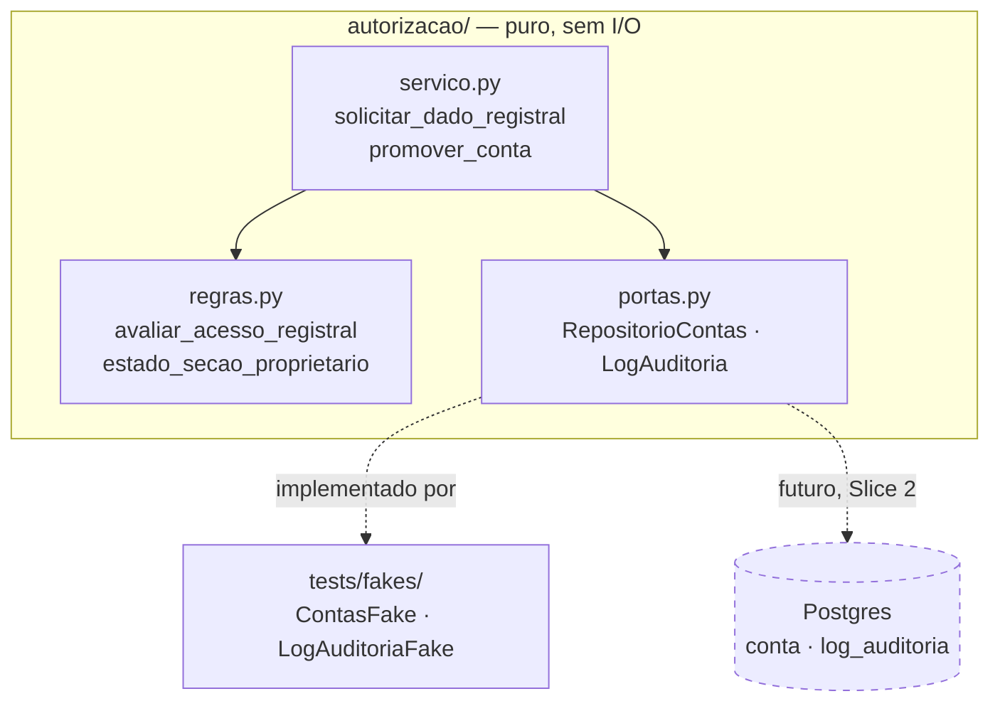

# Gate de Permissão Jurídica (P2) — Design

**Spec**: `.specs/features/gate-juridico-p2/spec.md`
**Status**: Draft
**Traction mode**: MVP — este gate não entrega valor visível a um usuário final hoje; entrega
valor estrutural (evita reescrita quando a camada registral for liberada). O design fica no menor
formato que já torna GATE-01..06 verdadeiros por construção.

**Decisões ativas relevantes (`.specs/STATE.md`)**: AD-002 (camada de proprietário fora do MVP,
gate arquitetado vazio — é a razão de existir desta feature) e AD-007 (monolito Python modular —
este módulo entra no mesmo pacote `terrametrica`, sem novo deployable). Nenhuma decisão conflita;
nenhuma supersessão necessária.

**Isolamento operacional**: `dossie-lote-rj` Fatia 2 está em execução em outra sessão, tocando
`persistencia/` e `ingestao/`. Este design **não cria nem modifica nenhum arquivo nesses dois
diretórios** — só lê (nunca escreve) `dominio/modelos.py` para reusar `PapelConta`, e cria um
módulo novo (`autorizacao/`) que nenhuma outra fatia toca.

---

## Architecture Overview

Domínio puro (sem I/O), no mesmo padrão da Fatia 1 de `dossie-lote-rj`: value objects + Protocols
(ports) + funções puras de decisão, testados com fakes em memória. Nenhuma tabela real é criada
nesta fatia — `conta` e `log_auditoria` continuam reservadas e vazias (AD-002), agora com a forma
do domínio já provada por teste.



---

## Code Reuse Analysis

### Existing Components to Leverage

| Component | Location | How to Use |
| --- | --- | --- |
| `PapelConta` (enum `consulta`/`habilitado_juridicamente`) | `src/terrametrica/dominio/modelos.py` | Reusado sem modificação — já foi projetado como "fronteira reservada do gate jurídico (P2)" na Fatia 1 de `dossie-lote-rj` |
| Padrão Protocol + fake em memória | `src/terrametrica/dossie/portas.py`, `tests/fakes/repositorio_fake.py` | Mesmo padrão arquitetural aplicado a `autorizacao/portas.py` — nenhum I/O importado, testável sem Postgres |
| `ErroValidacao` (boundary) | `src/terrametrica/dominio/modelos.py` | Reusado para rejeitar estado ilegal nos value objects novos desta feature |

### Integration Points

| System | Integration Method |
| --- | --- |
| `dominio/modelos.py` | Leitura apenas (`PapelConta`); nenhuma escrita nesta fatia |
| Persistência real (Postgres) | Nenhuma nesta fatia — ports ficam sem adapter concreto até a Slice 2, quando `persistencia/conexao.py`/`migrar.py` da Fatia 2 de `dossie-lote-rj` estiverem estáveis |
| API HTTP | Nenhuma nesta fatia — `Negado`/`Permitido` é um tipo de domínio; a tradução para HTTP 403 é responsabilidade de uma fatia futura de API |

---

## Perspective Sweep

- **Structure** — um módulo novo, `autorizacao/`, paralelo a `dossie/`/`geometria/`; nenhuma dependência de `persistencia/`/`ingestao/` (isolamento da outra sessão).
- **Integration** — nenhuma integração externa nesta fatia; os ports isolam a futura troca fake→Postgres sem tocar `servico.py`/`regras.py` (mesmo padrão provado em `dossie/montagem.py` na Fatia 1).
- **Data** — `Conta` e `EntradaAuditoria` são value objects em memória nesta fatia; o esquema real (`conta`, `log_auditoria`) já está reservado no `design.md` de `dossie-lote-rj` e não é duplicado aqui — só referenciado.
- **Security** — é o próprio assunto da feature: papel fechado (enum), decisão de acesso sempre logada, nenhum campo capaz de representar dado pessoal (GATE-06 verificado por ausência de campo, não por regra em runtime).
- **Infra & ops** — nenhuma nesta fatia (sem deploy novo, sem serviço novo); observabilidade é o próprio log de auditoria como estrutura de domínio.
- **Domain** — vocabulário alinhado a `docs/produto/glossario.md` e ao já usado em `dominio/modelos.py` (`PapelConta`). Nenhum termo novo inventado além do estritamente necessário (`Conta`, `EntradaAuditoria`, `ResultadoAcesso`).

**Tensão observada e resolvida**: a spec pede HTTP 403 (GATE-03) e log "imutável" (GATE-05), mas
esta fatia não tem API nem banco. Resolução: o domínio produz o resultado que uma API futura
mapeia para 403 (`Negado`), e a imutabilidade real do log é propriedade de uma tabela append-only
da Slice 2 — aqui, a garantia é estrutural mais fraca (o port `LogAuditoria` só expõe `registrar`,
nunca `remover`/`editar`, então nada no domínio pode violar a imutabilidade mesmo sem banco).

---

## Components

### `autorizacao` (domínio puro)

- **Purpose**: decidir acesso a dado registral, decidir estado da seção de proprietário, e
  orquestrar a promoção de papel — sempre com log de auditoria como efeito obrigatório.
- **Location**: `src/terrametrica/autorizacao/`
- **Interfaces**:
  - `regras.py`:
    - `avaliar_acesso_registral(papel: PapelConta) -> ResultadoAcesso` — `Permitido` se `HABILITADO_JURIDICAMENTE`, `Negado` caso contrário (GATE-03)
    - `estado_secao_proprietario(papel: PapelConta) -> EstadoSecao` — sempre `Indisponivel("indisponível nesta versão")` enquanto `CAMADA_REGISTRAL_LIGADA = False`, para qualquer papel (GATE-02)
  - `servico.py`:
    - `solicitar_dado_registral(conta_id: str, finalidade: str, lote_id: str, instante: datetime, repo: RepositorioContas, log: LogAuditoria) -> ResultadoAcesso` — busca o papel via `repo`, aplica `avaliar_acesso_registral`, registra em `log` **sempre** (permitido ou negado), devolve o resultado (GATE-03, GATE-05)
    - `promover_conta(conta_id: str, promovido_por: str, credencial_verificada: str, instante: datetime, repo: RepositorioContas, log: LogAuditoria) -> Conta` — muda o papel para `HABILITADO_JURIDICAMENTE` via `repo`, registra a promoção em `log` com quem/quando/credencial (GATE-04)
  - `portas.py`:
    - `RepositorioContas` (Protocol): `papel_de(conta_id) -> PapelConta`, `promover(conta_id, novo_papel) -> Conta`
    - `LogAuditoria` (Protocol): `registrar(entrada: EntradaAuditoria) -> None`
- **Dependencies**: `dominio/modelos.py` (`PapelConta`, `ErroValidacao`) — nenhuma outra
- **Reuses**: padrão Protocol + fake de `dossie/portas.py` e `tests/fakes/repositorio_fake.py`

### Value objects novos (em `dominio/modelos.py`, mesma convenção da Fatia 1)

- `Conta(id: str, papel: PapelConta)` — frozen, sem campo de nome/CPF/CNPJ (GATE-06 por
  impossibilidade estrutural, não por validação)
- `EntradaAuditoria(id: str, ts: datetime, conta_id: str, tipo: TipoEventoAuditoria, finalidade: str | None, lote_id: str | None, promovido_por: str | None, credencial_verificada: str | None)` — um único formato de entrada cobre consulta e promoção; campos não aplicáveis ao tipo de evento ficam `None` (estado ilegal parcialmente representável aqui é aceito porque a alternativa — duas classes de entrada — não muda nenhum teste desta fatia; revisitar se a Slice 2 achar necessário)
- `TipoEventoAuditoria` (enum fechado): `CONSULTA_REGISTRAL`, `PROMOCAO`
- `ResultadoAcesso` (união fechada): `Permitido | Negado`
- `EstadoSecao` (união fechada): `Indisponivel(mensagem: str)` — única variante nesta versão (AD-002); a união existe para a Slice futura acrescentar `Disponivel` sem quebrar o tipo de retorno

---

## Data Models

Nenhuma tabela é criada nesta fatia. Para continuidade com o esquema já reservado em
`dossie-lote-rj/design.md`:

```
-- Já reservado (Fatia 1 de dossie-lote-rj), inalterado por esta feature:
conta(id, email, papel /* consulta|habilitado_juridicamente */)

-- Novo, só quando a Slice 2 desta feature existir (fora de escopo agora):
log_auditoria(id, ts, conta_id, tipo /* consulta_registral|promocao */,
               finalidade, lote_id, promovido_por, credencial_verificada)
```

**Relationships**: `log_auditoria.conta_id` referenciaria `conta.id` quando a Slice 2 existir.
Nesta fatia, `Conta` e `EntradaAuditoria` só existem como value objects em memória, manipulados
através dos ports acima.

---

## Testing Seams

| Seam (onde o teste se prende) | Existente ou Novo | O que um teste afirma através dele | Reusa |
| --- | --- | --- | --- |
| `avaliar_acesso_registral(papel)` — função pura | Novo | `CONSULTA` → `Negado`; `HABILITADO_JURIDICAMENTE` → `Permitido` (GATE-01/03) | Padrão de `geometria/regras.py` (função pura testada por valor de entrada/saída) |
| `estado_secao_proprietario(papel)` — função pura | Novo | Sempre `Indisponivel(...)` para os dois papéis enquanto a constante estiver `False` (GATE-02) | Mesmo padrão acima |
| `RepositorioContas` / `LogAuditoria` (Protocols) | Novo, mesmo padrão de `dossie/portas.py` | `servico.solicitar_dado_registral`/`promover_conta` cumprem o contrato contra um fake em memória — sem depender de Postgres | Padrão Protocol + fake de T4/T5 de `dossie-lote-rj` |
| `servico.solicitar_dado_registral` — função de orquestração | Novo | Toda chamada (permitida ou negada) produz exatamente 1 entrada de log (GATE-05); nunca 0, nunca 2 | — |
| `servico.promover_conta` — função de orquestração | Novo | Entrada de log de promoção carrega `promovido_por`, `instante` e `credencial_verificada` (GATE-04) | — |

> Nenhum seam novo de infraestrutura (sem container, sem banco) — mesma classe de teste que a
> Fatia 1 de `dossie-lote-rj` (unit puro, fake em memória).

---

## Error Handling Strategy

| Error Scenario | Handling | User Impact |
| --- | --- | --- |
| `conta_id` desconhecido em `solicitar_dado_registral` | `RepositorioContas.papel_de` levanta `ErroValidacao` (contrato do port, propagada) | Falha explícita, não um `Negado` silencioso disfarçando um bug de integração |
| Papel desconhecido/fora do enum | Impossível por construção — `PapelConta` é `StrEnum` fechado | — |
| Log falha ao registrar (port levanta exceção) | Propaga a exceção — `solicitar_dado_registral`/`promover_conta` **não devolvem resultado se o log não foi gravado** (GATE-05 é obrigação, não best-effort) | Falha visível em vez de acesso sem auditoria |

---

## Risks & Concerns

| Concern | Location | Impact | Mitigation |
| --- | --- | --- | --- |
| `EntradaAuditoria` com campos opcionais por tipo de evento (não union fechada por tipo) | `dominio/modelos.py` (novo) | Um evento `CONSULTA_REGISTRAL` poderia teoricamente ser construído com `promovido_por` preenchido — estado espúrio representável | Aceito nesta fatia (ver Components); revisitar na Slice 2 se surgir um bug real ligado a isso — não promovido a TD-NNN porque nenhuma reingestão ou dado real depende disso ainda |
| Mecanismo de "credencial verificada" não especificado em nenhum documento do produto | `spec.md` (Out of Scope) | Um esquema real de verificação (OAB, gov.br) pode exigir campos estruturados além de `str` opaca | Ports isolam a mudança — trocar `str` por um value object estruturado no futuro não muda `servico.py`, só `portas.py`/`dominio/modelos.py` |

---

## Tech Decisions (only non-obvious ones)

| Decision | Choice | Rationale |
| --- | --- | --- |
| Onde entram os value objects novos | `dominio/modelos.py` (mesmo arquivo da Fatia 1), não um `autorizacao/modelos.py` próprio | Convenção já estabelecida: `dominio/modelos.py` é "o hub do vocabulário ubíquo" (docstring do próprio arquivo); `PapelConta` já mora lá |
| `CAMADA_REGISTRAL_LIGADA` como constante Python, não config externa | Constante em `autorizacao/regras.py` | Não existe mecanismo de config no projeto ainda (nenhuma fatia criou um); uma constante é verdadeira por construção e não finge uma flexibilidade que não existe |
| Log como obrigação síncrona (propaga erro se falhar) | Decisão em Error Handling Strategy acima | GATE-05 diz "SHALL registrar" sem exceção — um acesso sem log correspondente violaria a garantia de auditoria que é a própria razão de ser desta feature |
