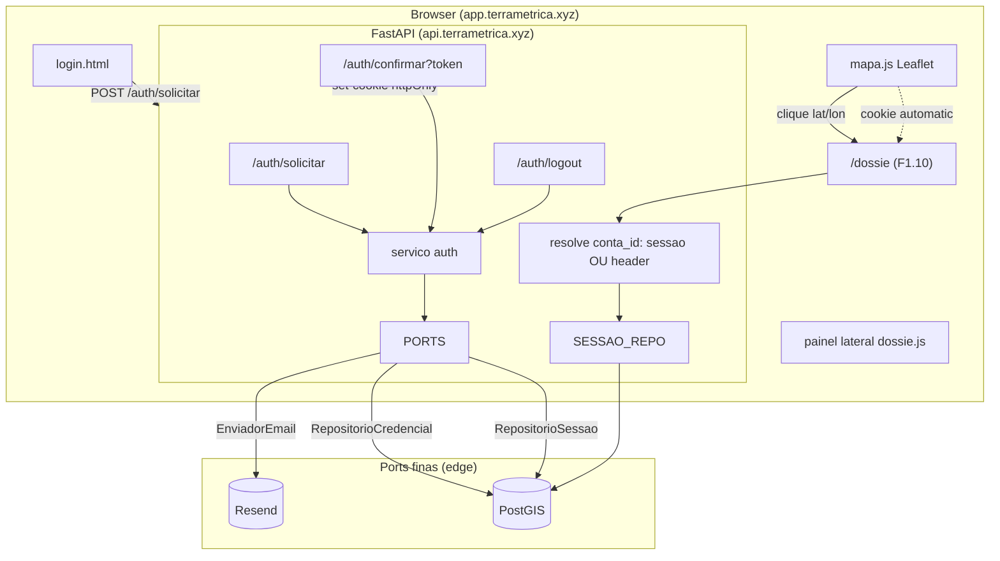

# Painel Web + Conta Autenticada (F1.11) Design

**Spec**: `.specs/features/painel-web-conta/spec.md`
**Status**: Draft
**Escopo**: Large — auth (magic link + sessão) + front vanilla + nova origem de identidade da API

---

## Architecture Overview

Três blocos, um deployable a mais (o front estático):

1. **Módulo de auth em Python puro** (`terrametrica.auth`) — o único lugar do backend que toca PII
   de login (e-mail). Emite magic link, valida token, cria/autentica conta, gere sessão. Segue a
   filosofia dos módulos existentes: regras framework-agnósticas + ports finas para I/O (banco,
   e-mail), rota FastAPI fina orquestrando.
2. **Nova via de identidade na API** — o `GET /dossie`/`/cobertura` da F1.10 ganha uma **segunda
   forma de resolver `conta_id`**: cookie de sessão, além do header `X-Conta-Id` que continua
   existindo. Nenhum contrato de dossiê muda (Success Criteria 3).
3. **Front vanilla estático** (`app/`, AD-012) — login por e-mail, mapa Leaflet, painel lateral do
   dossiê. Sem build step, evolui `prototipos/mapa-dossie/`.



**Fluxo do magic link (P1):**

```mermaid
sequenceDiagram
    participant U as Pessoa
    participant F as login.html
    participant A as /auth/solicitar
    participant DB as credencial_login + login_token
    participant R as Resend
    participant C as /auth/confirmar
    participant S as sessao

    U->>F: informa e-mail
    F->>A: POST {email}
    A->>A: valida e-mail (422 se malformado)
    A->>A: rate limit 5/h por e-mail (429 na 6a)
    A->>DB: grava token opaco (15min, uso unico)
    A->>R: envia link com token
    A-->>F: 202 (link enviado) / 502 (falha Resend)
    U->>C: clica link (GET ?token=...)
    C->>DB: token valido, nao usado, nao expirado?
    alt invalido/expirado/usado
        C-->>U: 401 "link invalido ou expirado"
    else valido
        C->>DB: invalida token; upsert conta (papel CONSULTA se nova)
        C->>S: cria sessao 30d
        C-->>U: 302 /mapa + Set-Cookie httpOnly/Secure/SameSite=Lax
    end
```

---

## Approach Exploration

**Decisão macro (front) já resolvida em AD-012** (vanilla estático). As duas alternativas de
*arquitetura de auth* abaixo são o que resta explorar; a escolha molda `terrametrica.auth`.

### Abordagem A — Módulo `auth` isolado + nova dependency de identidade (RECOMENDADA)

`terrametrica.auth` é um módulo novo e autocontido (regras + ports). A API ganha uma dependency
`conta_id_da_sessao_ou_header` que substitui `conta_id_obrigatorio` nas rotas de dossiê: tenta o
cookie de sessão primeiro, cai para o header `X-Conta-Id` se não houver cookie.

- **Prós**: isola 100% da PII de login num módulo (mantém GATE-06 estrutural — `Conta` nunca vê
  e-mail); reusa o padrão ports/regras/rota-fina já dominante; o header antigo continua funcionando
  para clientes de API (Success Criteria 2); superfície de mudança na F1.10 é **uma linha por rota**
  (troca a dependency injetada).
- **Contras**: duas fontes de identidade coexistem (sessão + header) — precisa de um teste que prove
  a precedência e que o header sozinho ainda funciona.

### Abordagem B — Sessão substitui o header (via única)

Remover `X-Conta-Id`, toda identidade vem de sessão.

- **Prós**: uma via só, mais simples de raciocinar.
- **Contras**: **quebra a F1.10** e o contrato do `test_api_e2e` (401 sem header). Viola Success
  Criteria "a via `X-Conta-Id` manual continua existindo para outros clientes de API". Rejeitada.

### Abordagem C — Auth como serviço/processo separado

- **Contras**: é exatamente o 2º runtime que a spec (linha 30/58) e AD-012 rejeitam. Rejeitada.

> **Recomendação: A.** É a única que honra Success Criteria 2 e 3 (F1.10 intacta, header coexiste)
> e o padrão arquitetural do repo. As demais só entram se um requisito novo aparecer.

---

## Perspective Sweep

| Lente | Tensão / decisão |
| --- | --- |
| **Structure** | `auth` é módulo irmão de `dossie`/`autorizacao`: `regras` puras + `portas` Protocol + rota fina. Não importa `autorizacao` nem `dossie` (acoplamento evitado — confirmado no grep: os módulos só importam de `dominio`); só compartilha `Conta`/`PapelConta`/`ContaId` do `dominio`. **Tier (domain-first-structure): `auth` é Support** — serve todo pilar, é a cara de nenhum (como `notifications`/`billing` no exemplo da skill). Isso resolve a tensão com a regra "identidade é Cross-cutting → nunca vira pasta": ela se aplica à *aplicação* da identidade (resolver `conta_id` numa request), que por isso **não** vive em `auth/` — vive como concern estendendo `api/identidade.py`. O *mecanismo* de login (emitir link, gerir sessão) é um fluxo Support com vocabulário próprio → merece a pasta. Mecanismo=pasta Support; aplicação=concern cross-cutting na borda da API. |
| **Integration** | Contrato do dossiê **não muda** — só a origem de `conta_id`. Falha do Resend é síncrona e visível (502), nunca 200 mudo (Edge Case). |
| **Data** | Duas tabelas novas isolam PII: `credencial_login` (e-mail↔conta) e `login_token`; `sessao` guarda hash do token de sessão, não o valor. `Conta`/`consulta_log`/`cobertura` intactos. Sem `versao_base_id` — auth não é versionado por base (AD-008 não se aplica). |
| **Security** | httpOnly+Secure+SameSite=Lax; cookie de sessão = valor opaco aleatório, **hash no banco** (vazamento de dump não dá sessão); token de magic link uso único + 15min; mensagens genéricas (401/422) para não vazar existência de e-mail (anti-enumeração, spec linhas 62-63); rate limit 5/h por e-mail (anti e-mail bomb). |
| **Infra & ops** | Subdomínios `app.` (estático) e `api.` (uvicorn) sob domínio pai para o cookie `Domain=.terrametrica.xyz`. Front = arquivos atrás de nginx/Caddy. Segredos: `RESEND_API_KEY`, `TERRAMETRICA_BASE_URL` (para montar o link). **RFD de infra abaixo.** |
| **Domain** | Vocabulário novo: *credencial de login*, *token de login (magic link)*, *sessão*. `Conta` e o gate jurídico (`PapelConta`) **não** ganham vocabulário — a fronteira GATE-06 fica intacta por construção. |

---

## Code Reuse Analysis

### Existing Components to Leverage

| Componente | Local | Como usar |
| --- | --- | --- |
| `Conta`, `PapelConta.CONSULTA` | `dominio/modelos.py:65,310` | Conta nasce `CONSULTA` na confirmação; sem novo campo (GATE-06 intacto). |
| `ContaId` / dependency de identidade | `api/identidade.py` | **Estender**: nova dependency resolve sessão→header. Comentário do arquivo já prevê "o único ponto que muda quando o mecanismo de auth real nascer". |
| Rotas `/dossie`,`/cobertura` | `api/app.py:60-90` | Trocar a dependency injetada; corpo das rotas inalterado. |
| `dossie_para_dict` (shape) | `api/dto.py:25` | O front renderiza esse JSON: `lote`, `restricoes`, `proveniencia`, `camadas_*`, `ressalva`. |
| `ErroValidacao` no boundary | `dominio/modelos.py` | E-mail malformado → `ErroValidacao` → 422 genérico (mesmo padrão de `Coordenada`). |
| `abrir_conexao` / `TERRAMETRICA_DB_URL` | `persistencia/conexao.py` | Ports de auth abrem conexão pelo mesmo caminho. |
| `aplicar_migracoes` + `migracoes/NNNN_*.sql` | `persistencia/migrar.py` | Novas tabelas via `0006_fatia7_auth.sql` (padrão idempotente `IF NOT EXISTS`). |
| Layout do dossiê + interação de mapa | `prototipos/mapa-dossie/index.html` | **Base do front** (AD-012): reusa CSS/layout do painel; troca polígonos sintéticos por Leaflet+tiles e fetch autenticado. |
| Padrão de teste e2e API | `tests/integration/api/test_api_e2e.py` | Mesmo `TestClient` + PostgisContainer; estende para os fluxos de auth. |

### Integration Points

| Sistema | Método de integração |
| --- | --- |
| API F1.10 | Nova dependency de identidade (sessão OU header); zero mudança de contrato. |
| PostGIS | 3 tabelas novas na mesma base, migração `0006`. |
| Resend | Port `EnviadorEmail` (Protocol) — fake em teste, HTTP real em prod. |

---

## Components

### 1. `auth/regras.py` — regras puras de auth

- **Purpose**: decisões de auth sem I/O — validar e-mail, gerar token opaco, avaliar validade de
  token/sessão, decidir criação-vs-autenticação de conta.
- **Location**: `src/terrametrica/auth/regras.py`
- **Interfaces**:
  - `validar_email(bruto: str) -> Email` — narrow no boundary; `ErroValidacao` se malformado.
  - `gerar_token_opaco() -> str` — `secrets.token_urlsafe`, alta entropia.
  - `hash_token(token: str) -> str` — hash determinístico (sha256) para guardar no banco.
  - `token_valido(registro: RegistroToken, agora: datetime) -> bool` — não expirado, não usado.
- **Dependencies**: `secrets`, `hashlib` (stdlib), `dominio` (`ErroValidacao`).
- **Reuses**: padrão de value object validado do `dominio`.

### 2. `auth/portas.py` — contratos de I/O

- **Purpose**: Protocols que o serviço consome; nenhuma implementação.
- **Location**: `src/terrametrica/auth/portas.py`
- **Interfaces**:
  - `RepositorioCredencial.conta_de_email(email: Email) -> str | None`
  - `RepositorioCredencial.criar_conta_para_email(email: Email, papel: PapelConta) -> str`
  - `RepositorioToken.salvar(hash_token, email, expira_em) -> None`
  - `RepositorioToken.consumir(hash_token, agora) -> Email | None` — atômico: valida+marca usado numa transação, devolve o e-mail ou `None`.
  - `RepositorioToken.contar_na_janela(email, desde) -> int` — para o rate limit 5/h.
  - `RepositorioSessao.criar(conta_id, expira_em) -> str` (token de sessão em claro p/ cookie; grava hash)
  - `RepositorioSessao.conta_de_sessao(hash_sessao, agora) -> str | None`
  - `RepositorioSessao.invalidar(hash_sessao) -> None`
  - `EnviadorEmail.enviar_magic_link(email: Email, link: str) -> None` — levanta em falha (→502).
- **Dependencies**: `typing.Protocol`, `dominio`.
- **Reuses**: espelha o estilo `autorizacao/portas.py`.

### 3. `auth/servico.py` — orquestração do fluxo

- **Purpose**: coreografa regras+ports para os 3 casos de uso (solicitar, confirmar, logout).
- **Location**: `src/terrametrica/auth/servico.py`
- **Interfaces**:
  - `solicitar_magic_link(email_bruto, agora, repo_token, repo_cred, enviador, base_url) -> None`
    — valida (422), checa rate limit (429), gera+salva token, envia. **Não** revela se o e-mail
    tem conta (anti-enumeração).
  - `confirmar_login(token, agora, repo_token, repo_cred, repo_sessao) -> ResultadoLogin` —
    consome token (401 se inválido), upsert conta (`CONSULTA` se nova), cria sessão 30d, devolve o
    token de sessão em claro para a rota setar o cookie.
  - `encerrar_sessao(hash_sessao, repo_sessao) -> None`
- **Dependencies**: componentes 1 e 2.
- **Reuses**: padrão `autorizacao/servico.py` (orquestra ports+regras, I/O fica nas ports).

### 4. `auth/adaptadores.py` — implementações Postgres + Resend

- **Purpose**: implementações reais das ports (edge, I/O).
- **Location**: `src/terrametrica/auth/adaptadores.py`
- **Interfaces**: `RepositorioCredencialPostgres`, `RepositorioTokenPostgres`,
  `RepositorioSessaoPostgres` (recebem `conexao` como os repos existentes); `EnviadorResend`
  (`RESEND_API_KEY`, usa `httpx` — já dep de dev; **promover a runtime**).
- **Dependencies**: `psycopg`, `httpx`.
- **Reuses**: `abrir_conexao`; padrão de repo dos `*_postgis.py`.

### 5. `api/identidade.py` — estender resolução de identidade

- **Purpose**: resolver `conta_id` por sessão (cookie) OU header (retrocompat).
- **Location**: `src/terrametrica/api/identidade.py` (estende o existente)
- **Interfaces**:
  - `conta_id_da_sessao_ou_header(cookie, x_conta_id, repo_sessao) -> str` — cookie válido →
    `conta_id`; senão header; senão 401. Mantém `conta_id_obrigatorio` para quem só usa header.
- **Dependencies**: `RepositorioSessao`.
- **Reuses**: a própria dependency existente e o comentário-guia do arquivo.

### 6. Rotas de auth — `api/app.py` (entrypoint fino)

- **Purpose**: 3 rotas finas que só traduzem HTTP↔serviço.
  - `POST /auth/solicitar` → `solicitar_magic_link`; 202 sucesso, 422 e-mail ruim, 429 rate limit, 502 Resend.
  - `GET /auth/confirmar?token=` → `confirmar_login`; 302+Set-Cookie sucesso, 401 inválido.
  - `POST /auth/logout` → `encerrar_sessao`; 204 + expira cookie.
- **Reuses**: `criar_app` (injeção de ports por parâmetro, como `limitador`/`relogio` hoje).

### 7. Front vanilla — `app/`

- **Purpose**: login, mapa, painel do dossiê. Sem build (AD-012).
- **Location**: `app/` (novo, na raiz)
  - `login.html` — form e-mail → `POST /auth/solicitar` (`credentials:'include'`).
  - `index.html` + `mapa.js` — Leaflet + tiles OSM; clique → `GET /dossie?lat&lon`; 401 → redirect login.
  - `dossie.js` — render do painel lateral a partir de `dossie_para_dict` (reusa layout do protótipo); trata 200/404/409/429.
  - `estilos.css` — herdado/adaptado do protótipo.
- **Reuses**: `prototipos/mapa-dossie/` (layout, render do dossiê, testes `node --test` de módulos JS puros).

---

## Data Models

Migração `0006_fatia7_auth.sql` (idempotente, padrão do repo). PII **isolada** de `Conta`.

```sql
-- e-mail ↔ conta (a ÚNICA tabela com PII de login). GATE-06: fora da struct Conta.
CREATE TABLE IF NOT EXISTS credencial_login (
    email      text PRIMARY KEY,           -- normalizado (lower/trim)
    conta_id   text NOT NULL,              -- referencia lógica à conta (papel vive no dominio)
    criado_em  timestamptz NOT NULL DEFAULT now()
);

-- magic links emitidos. Guarda HASH do token, nunca o valor.
CREATE TABLE IF NOT EXISTS login_token (
    hash_token text PRIMARY KEY,
    email      text NOT NULL,
    criado_em  timestamptz NOT NULL DEFAULT now(),
    expira_em  timestamptz NOT NULL,
    usado_em   timestamptz                 -- NULL = ainda não usado (uso único)
);
CREATE INDEX IF NOT EXISTS idx_login_token_email_criado ON login_token (email, criado_em); -- rate limit 5/h

-- sessões ativas. Guarda HASH do token de sessão.
CREATE TABLE IF NOT EXISTS sessao (
    hash_sessao text PRIMARY KEY,
    conta_id    text NOT NULL,
    criado_em   timestamptz NOT NULL DEFAULT now(),
    expira_em   timestamptz NOT NULL
);
CREATE INDEX IF NOT EXISTS idx_sessao_conta ON sessao (conta_id);
```

**Relationships**: `credencial_login.conta_id` e `sessao.conta_id` referenciam a conta cujo papel
vive no domínio/`consulta_log`. Não há FK para uma tabela `conta` física (o papel é modelado no
domínio; o MVP não materializa `conta` — coerente com AD-002/AD-011). `login_token`/`sessao` são
efêmeras (expiram). Nenhuma carrega `versao_base_id` (não versionadas por base).

---

## Testing Seams

| Seam (onde o teste ancora) | Existente ou Novo | O que o teste afirma | Reusa |
| --- | --- | --- | --- |
| `solicitar_magic_link(...)` | Novo (justif.: caso de uso de domínio, não detalhe) | 422 e-mail ruim; token salvo c/ 15min; 6ª chamada/h → nada enviado; falha do enviador propaga | fakes em memória das ports (padrão `autorizacao`) |
| `confirmar_login(...)` | Novo | token válido→sessão+conta `CONSULTA`; e-mail conhecido→autentica (não duplica conta); token usado/expirado→resultado inválido; token consumido não reautentica | fakes das ports |
| `conta_id_da_sessao_ou_header` (dependency) | Estende `api/identidade.py` | cookie válido→conta da sessão; sem cookie→header; nenhum→401; **header sozinho ainda funciona** (retrocompat F1.10) | `TestClient` |
| Rotas `/auth/*` via `TestClient` | Reusa harness de `test_api_e2e.py` | 202/422/429/502 em solicitar; 302+Set-Cookie vs 401 em confirmar; 204+cookie expirado em logout; clique autenticado por cookie retorna dossiê | `criar_app` + PostgisContainer |
| Módulos JS do front (`dossie.js`) | Reusa `node --test` do protótipo | render de 200/404/409/429 a partir de um JSON fixo de `dossie_para_dict` | `prototipos/mapa-dossie/tests` |

> `criar_app` já aceita ports injetadas (`limitador`, `relogio`) — as ports de auth entram pelo mesmo
> mecanismo, sem novo seam de bootstrap. Único seam novo real: a fronteira `auth/portas.py` (Protocol),
> justificada como a borda de I/O do módulo, espelhando `autorizacao/portas.py`.
>
> **Divergência consciente do `domain-first-structure` §5** ("tests mirror the domain, not a technical
> layer"): o repo organiza `tests/` **por camada técnica** (`tests/unit/api`, `tests/integration/persistencia`),
> não por domínio. Este design **segue o padrão do repo** de propósito — os testes de auth vão para
> `tests/unit/auth` + `tests/integration/api` (fluxo HTTP) — porque AGENTS.md "match the codebase you're
> in" vence a skill quando o repo já tem convenção estabelecida, e a própria skill §5 abre exceção para
> isso ("flag it back if a stack's own convention already satisfies the intent"). Não é gap de design;
> é a convenção existente, registrada aqui para não parecer descuido. Reorganizar `tests/` por domínio
> seria um refactor de todo o repo, fora do escopo de F1.11.

---

## Error Handling Strategy

| Cenário | Tratamento | Impacto no usuário |
| --- | --- | --- |
| E-mail malformado | `ErroValidacao` no boundary → 422 genérico | "e-mail inválido" — sem revelar se já tem conta |
| Token expirado/usado/inexistente | `confirmar_login` devolve inválido → 401 | "link inválido ou expirado" (motivo único, anti-oracle) |
| 6ª solicitação/hora p/ e-mail | rate limit → 429, nenhum e-mail | "muitas tentativas, aguarde" |
| Resend falha ao enviar | exceção da port propaga → 502 | erro explícito; não finge que enviou |
| Cookie de sessão corrompido/expirado | `conta_de_sessao`→`None` → 401/redirect | volta ao login; nunca 5xx |
| Sessão expira durante uso do mapa | `/dossie`→401 | painel redireciona ao login (spec P1-AC6) |
| Logout de sessão já invalidada | `invalidar` idempotente; reuso → 401 | como se nunca existisse (spec P2-AC2) |

---

## Risks & Concerns

| Concern | Local | Impacto | Mitigação |
| --- | --- | --- | --- |
| CSRF em `POST /auth/solicitar`/`logout` | rotas novas | terceiro dispara e-mail/logout via form cross-site | `SameSite=Lax` já bloqueia POST cross-site com cookie; `solicitar` é rate-limitado por e-mail; logout cross-site é baixo dano. Aceitável no MVP → **TD-NNN** se surgir formulário sensível. |
| Limpeza de `login_token`/`sessao` expirados | `0006` + adaptadores | tabelas crescem indefinidamente | Consultas já filtram por `expira_em`; job de GC fica **fora de escopo** (MVP) → registrar **TD-NNN**. |
| `httpx` era só dep de dev | `pyproject.toml:optional dev` | `EnviadorResend` precisa em runtime | Promover `httpx` para `dependencies` na migração 0006/tasks. |
| Ramo `SemLote` (TD-001) ainda quebrado | herdado F1.10 | clique em ponto sem lote → o backend levanta `NotImplementedError` no `municipio_em` | **Fora do escopo de F1.11** (independente, TD-001). O front trata 404 quando ele existir; nada a fazer aqui. |
| Sem materialização física de `conta` → integridade referencial só por convenção | `credencial_login`, `sessao`, `consulta_log` | 3 tabelas apontam para um `conta_id` que nenhuma tabela possui como PK; nada garante que o `conta_id` de uma sessão exista | Coerente com AD-002/AD-011 (a conta é conceito de domínio, o MVP não materializa `conta`). Mas AGENTS.md marca *data integrity* como decisão que "fica cara com o tempo" → promovido a **TD-006** (não fica só nesta tabela). Aceito no MVP, revisitar quando o gate jurídico (F2.3) materializar `conta`. |

> `conta_id`-sem-FK já promovido a **TD-006** (abaixo). Os outros concerns aceitos (CSRF-MVP, GC de
> `login_token`/`sessao` expirados) viram `TD-NNN` na fase Tasks — não ficam só aqui.

---

## Tech Decisions (não óbvias)

| Decisão | Escolha | Razão |
| --- | --- | --- |
| Front | Vanilla estático (Leaflet) | **AD-012** — coerência com rejeição do 2º runtime; reusa protótipo. |
| Arquitetura de auth | Módulo `auth` isolado + dependency de identidade estendida (Abordagem A) | Honra Success Criteria 2/3 (F1.10 intacta, header coexiste); segue padrão ports/regras/rota-fina. |
| PII de login | Tabela `credencial_login` fora de `Conta` | Mantém GATE-06 estrutural (spec linha 57). |
| Token de sessão/magic link | Valor opaco em claro no cookie/link, **hash no banco** | Dump do banco não concede sessão nem reuso de link. |
| Consumo de token | `consumir` atômico (valida+marca usado numa transação) | Uso único à prova de corrida (dois cliques simultâneos). |
| Precedência de identidade | Sessão > header | O painel usa sessão; header segue para clientes de API (Success Criteria 2). |

> **AD-012** já registrado em `.specs/STATE.md` (front vanilla). A Abordagem A e o isolamento de PII
> confirmam decisões já na spec — não geram novo AD. Se a precedência sessão>header virar padrão de
> outras rotas além de dossiê, aí sim promover a AD na fase Tasks.

---

## 🛑 RFD — Infra do deploy (MACRO, precisa de decisão antes de Execute)

O design é robusto a qualquer host, mas o **cookie de domínio pai** (spec linha 51) exige planejar
subdomínios, e há um segredo novo (Resend). Não bloqueia escrever Tasks, mas bloqueia rodar em prod.

**Contexto**: front em `app.terrametrica.xyz` (estático), API em `api.terrametrica.xyz` (uvicorn),
cookie `Domain=.terrametrica.xyz`. Precisa de: DNS dos subdomínios, TLS (o cookie é `Secure`),
`RESEND_API_KEY` + domínio verificado no Resend, `TERRAMETRICA_BASE_URL`.

- **Opção A** — VPS única + Caddy (TLS automático) servindo estático + reverse-proxy para uvicorn.
  Pros: um host, um cert, barato, simples. Cons: SPOF (aceitável no MVP).
- **Opção B** — Front em CDN/estático gerenciado (ex: Cloudflare Pages) + API em container à parte.
  Pros: front resiliente/rápido. Cons: dois lugares para operar, config de cookie cross-subdomínio
  mais sensível.

💡 **Recomendação: A** — coerente com "MVP de um dev", um cert e um lugar para operar; migra para B
se o tráfego justificar. **Decisão pode ficar para o fim de Execute** (o código não muda entre A e
B; só o empacotamento). Registrar como AD quando decidida.

---

## Next Step

Design pronto para revisão. Ao aprovar → fase **Tasks**: quebrar em tarefas atômicas mapeadas aos
14 requisitos `PAINEL-NN`, com a Test Coverage Matrix ancorada nos seams acima. A RFD de infra pode
ser resolvida no fim de Execute (não bloqueia Tasks).
