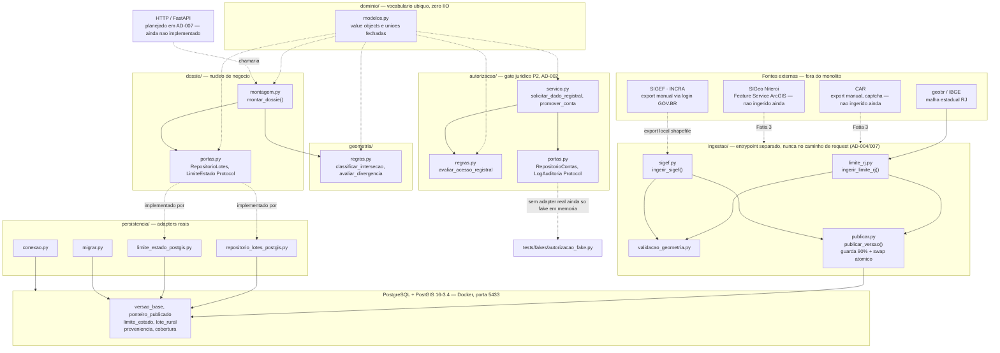
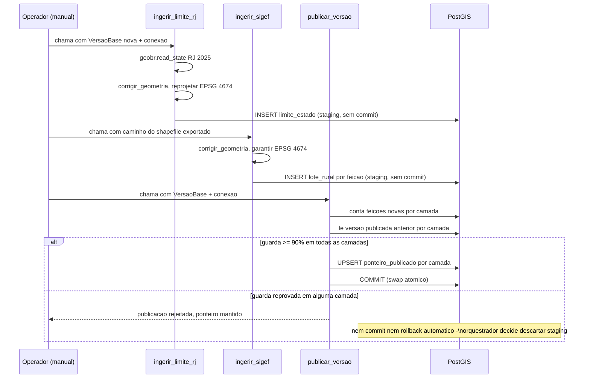
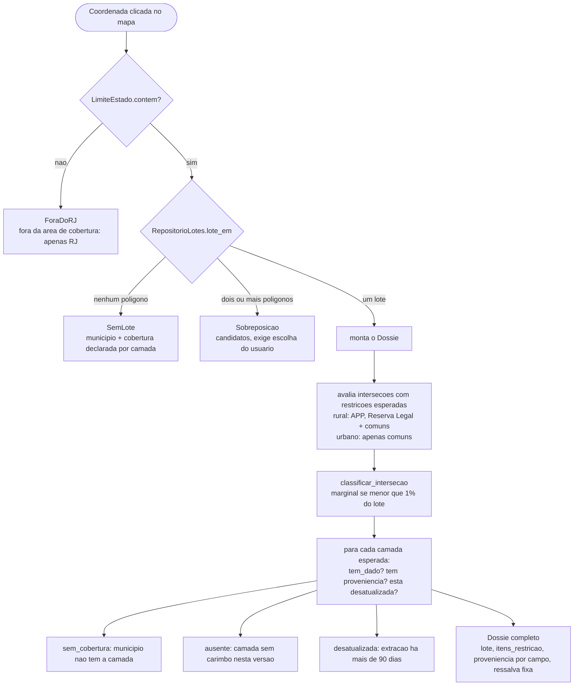
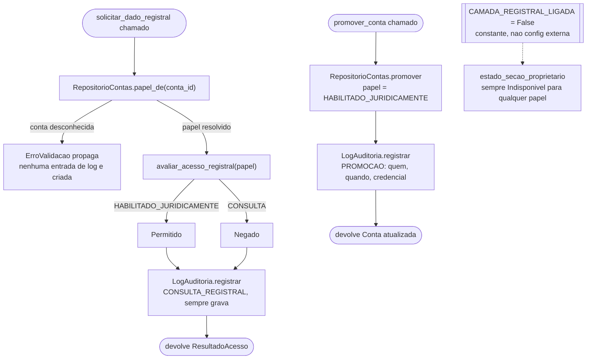
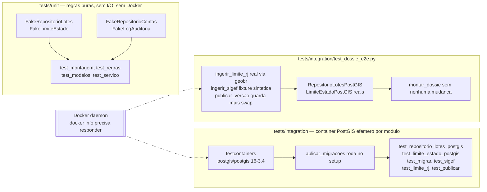

# Arquitetura — estado atual

Snapshot de engenharia. Descreve o que existe em `src/terrametrica/` hoje (Fatia 2 fechada,
AD-007 handoff em `.specs/STATE.md`), não o que está planejado — onde algo é planejado e ainda
não implementado, o diagrama diz isso explicitamente.

**Decisão que molda tudo abaixo (AD-007):** monolito Python modular, organizado por domínio, com
a **ingestão como entrypoint separado no mesmo repositório**. A ingestão nunca fica no caminho de
uma requisição — ela materializa um *read-model* versionado; o dossiê só lê o que já foi calculado.

---

## Visão geral de componentes

**Leitura do diagrama:**

- **Setas cheias** = dependência de execução (import ou I/O real).
- **Setas tracejadas** = dependência de tipo (`dominio/modelos.py`, sem I/O) ou relação declarada
  mas ainda não concretizada (HTTP planejado, CAR/SIGeo fora desta fatia).
- `dossie/portas.py` e `autorizacao/portas.py` são `Protocol` — a montagem e o serviço de
  autorização nunca importam `psycopg` ou `geopandas` diretamente. Isso é o que permite trocar o
  adapter fake (testes) pelo PostGIS real (produção) sem tocar a regra de negócio — provado por
  `tests/integration/test_dossie_e2e.py` (T14).
- **Não existe camada HTTP ainda.** `montar_dossie` e o serviço de autorização são chamados hoje
  só por testes. FastAPI está decidido (AD-007) mas não implementado — não há `main.py`, rota ou
  processo de servidor no repositório.
- **`autorizacao/` não tem adapter real.** Só o `Protocol` (`portas.py`) e um fake em memória
  (`tests/fakes/autorizacao_fake.py`). Não há tabela `conta` nem `entrada_auditoria` no schema
  Postgres — o gate jurídico está arquitetado (AD-002) mas a persistência dele é trabalho futuro.
- **CAR e SIGeo (camada urbana) não são ingeridos.** Só SIGEF (rural) tem pipeline real. `AreaM2`,
  `LoteUrbano` e a lógica de `LoteHit` já existem no domínio — a montagem já sabe lidar com lote
  urbano — mas não há linha em `ingestao/` nem tabela para ele ainda.

---

## Pipeline de ingestão e publicação

Os três passos rodam hoje via chamada direta de função (não há CLI nem agendador) — normalmente
disparados manualmente ou por um teste de integração/e2e.

Pontos que não são óbvios lendo o código isoladamente:

- `ingerir_limite_rj` e `ingerir_sigef` **nunca commitam** — quem orquestra decide o limite da
  transação. Isso é o que permite `publicar_versao` tratar limite + lote como uma unidade atômica.
- A guarda (`LIMIAR_GUARDA = 0.90`) é avaliada **por camada**, mas a decisão de publicar é única
  para a versão inteira: se qualquer camada reprovar, nenhuma é publicada — evita misturar um
  `limite_estado` novo com um `lote_rural` antigo.
- SIGEF não tem download programático (exige login GOV.BR humano) — `ingerir_sigef` lê de um
  shapefile já exportado, não da rede. CAR e SIGeo, quando entrarem (Fatia 3), seguem o mesmo
  padrão de porta de entrada por arquivo ou API, plugando em `publicar_versao` sem mudá-lo.

---

## Árvore de decisão do dossiê

Esta é literalmente a árvore documentada no docstring de `dossie/montagem.py` — quatro ramos
(`ForaDoRJ`, `SemLote`, `Sobreposicao`, `Dossie`), guard clauses, um caminho óbvio, sem
`else` aninhado. `montar_dossie` não faz I/O: recebe `repo` e `limite` como `Protocol`
(injeção de dependência via `dossie/portas.py`).

---

## Gate jurídico (P2) — fronteira arquitetada, sem dado pessoal

Regra de negócio central (AD-002, GATE-05): **toda decisão de acesso produz exatamente uma
entrada de auditoria antes de devolver o resultado** — permitida ou negada. O log é uma obrigação
síncrona: se `log.registrar` falhar, a exceção propaga e nenhum `ResultadoAcesso` é devolvido sem
o registro correspondente. `CAMADA_REGISTRAL_LIGADA` é hoje uma constante Python (`False`), não
uma config externa — nenhuma fatia do produto criou mecanismo de config ainda.

---

## Estratégia de testes

O e2e é a prova de que os *ports* isolam de verdade fake de real: `montar_dossie` não muda uma
linha entre `tests/unit` (fakes em memória) e `test_dossie_e2e.py` (adapters PostGIS reais) — só
o que é injetado muda.

---

## O que ainda não existe (para não ler o diagrama como se existisse)

| Item | Estado |
| --- | --- |
| Camada HTTP / FastAPI | Decidida (AD-007), zero código |
| Ingestão de CAR | Fora desta fatia — decisão explícita para provar o pipeline antes de somar fontes |
| Ingestão de SIGeo (Niterói, camada urbana) | Fase 0 confirmou acesso real (82.199 feições); sem código de ingestão ainda |
| Malha municipal IBGE | `municipio_em` levanta `NotImplementedError` — TD-001 em `.specs/TECH-DEBT.md` |
| Camadas de restrição (APP, UC, inundação, deslizamento, corpo d'água) | Modeladas no domínio; `intersecoes_de` sempre devolve `[]` — nenhuma foi ingerida |
| Adapter real de `autorizacao/portas.py` | Só fake em memória; sem tabela `conta`/`entrada_auditoria` no schema |
| CLI ou agendador de ingestão | Chamada de função direta, hoje só via teste |

Ver `.specs/STATE.md` para o log de decisões completo e o handoff atualizado.
