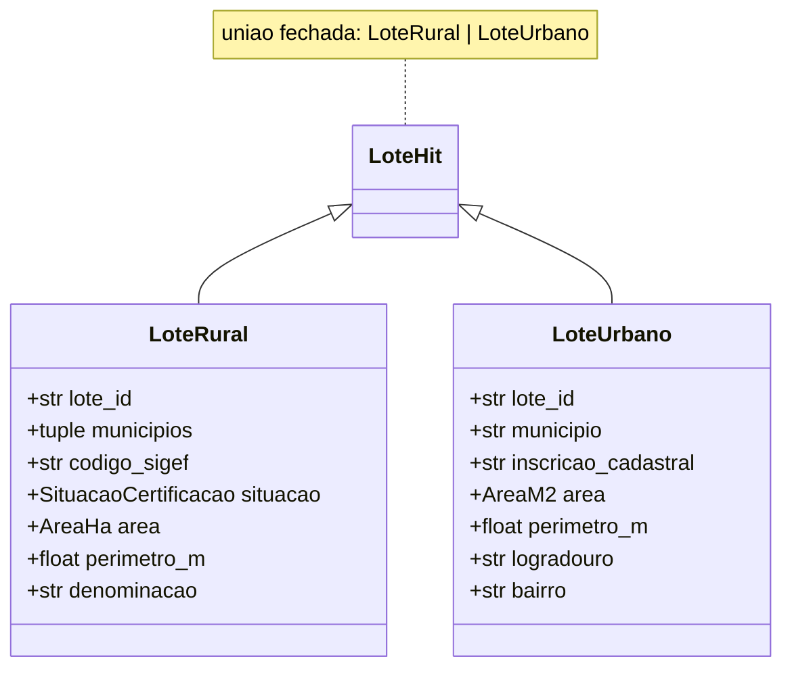
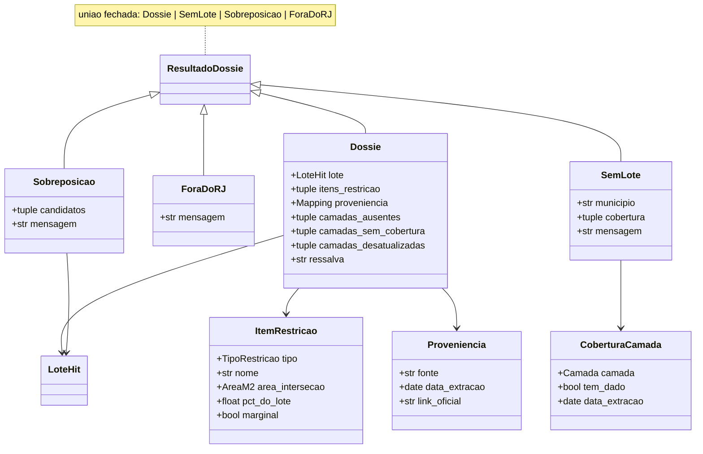
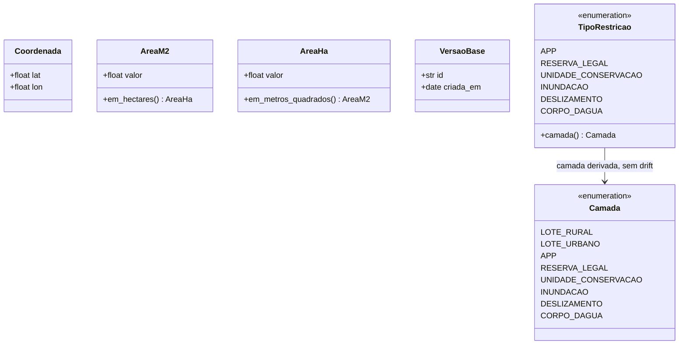
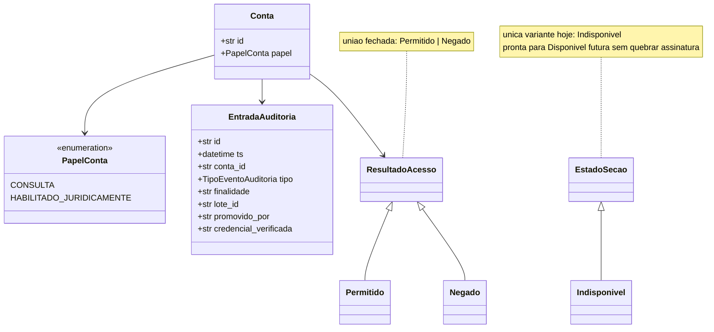

# Modelo de domínio — estado atual

Este documento é o mapa visual de `src/terrametrica/dominio/modelos.py`, o hub do vocabulário
ubíquo do projeto. Para a definição de cada termo em linguagem de produto (SIGEF, CAR, APP,
testada...), ver [glossário](produto/glossario.md) — este arquivo mostra a **forma** dos tipos,
não redefine o vocabulário.

Dois princípios de `AGENTS.md` moldam tudo abaixo:

- **Tornar estados ilegais irrepresentáveis** — conjuntos fechados (enum/união) em vez de
  string/bool livres.
- **Validar no boundary** — os construtores (`__post_init__`) rejeitam dado inválido na borda;
  código interno confia no tipo.

---

## Identidade do lote — união fechada

`LoteRural` guarda área em **hectares** (unidade do imóvel rural); `LoteUrbano` guarda área em
**m²** (unidade do lote urbano). A montagem do dossiê normaliza para m² internamente
(`_area_do_lote_m2`) só para comparar com a área da interseção — nunca converte a área exibida
ao usuário, que mantém a unidade natural de cada tipo.

`LoteUrbano` já existe no domínio, mas **não há linha de ingestão nem tabela Postgres para ele
ainda** — ver `docs/arquitetura.md`, seção "o que ainda não existe".

---

## Resultado da montagem — união fechada de 4 casos

`ResultadoDossie = Dossie | SemLote | Sobreposicao | ForaDoRJ` é o tipo de retorno de
`montar_dossie` — ver a árvore de decisão completa em `docs/arquitetura.md`. A união fechada é o
que torna impossível, em tempo de type-check (`mypy strict`), esquecer de tratar um dos quatro
casos no código que consome o dossiê.

Três distinções sutis dentro de `Dossie` que o código trata como diferentes, não como sinônimos
de "sem dado":

| Campo | Significa |
| --- | --- |
| `camadas_sem_cobertura` | O município não tem essa camada mapeada (fato estrutural, DOS-11) |
| `camadas_ausentes` | A camada existe no produto, mas esta versão não tem carimbo de proveniência (DOS-12) |
| `camadas_desatualizadas` | Tem proveniência, mas a extração passou de 90 dias (DOS-13) |

Nenhuma das três aparece como "vazio" ambíguo — AD-005 (proveniência é requisito, não enfeite).

---

## Value objects e enums de suporte

`Coordenada` valida faixa global de lat/lon no `__post_init__` — a contenção no RJ (DOS-05) é
responsabilidade do `Protocol` `LimiteEstado`, não deste value object, para o produto federar
outras UFs no futuro sem reescrever `Coordenada`. `AreaM2`/`AreaHa` rejeitam valor negativo e
sabem se converter entre si, mas **nunca se misturam sem conversão explícita** — não há um tipo
`Area` genérico que esconda a unidade.

`TipoRestricao.camada` é uma property, não um campo duplicado: a camada de origem de uma
restrição é sempre derivada do próprio tipo, então as duas listas nunca podem divergir por
esquecimento de atualizar uma sem a outra.

---

## Gate jurídico (P2) — sem dado pessoal

O detalhe estrutural que carrega a decisão de produto (AD-002): **`Conta` não tem nenhum campo
capaz de guardar nome, CPF ou CNPJ de proprietário.** A ausência de dado pessoal é garantia de
tipo, não uma regra validada em runtime que alguém pode esquecer de checar — é impossível
adicionar esse dado sem mudar a classe.

---

## Onde o vocabulário vira comportamento

O domínio (`dominio/modelos.py`) não faz I/O nem contém regra de decisão — só a forma dos dados.
As regras que operam sobre essa forma vivem em módulos separados:

| Módulo | O que decide |
| --- | --- |
| `dossie/montagem.py` | A árvore de 4 ramos que produz `ResultadoDossie` |
| `geometria/regras.py` | `classificar_intersecao` (marginal < 1%) e `avaliar_divergencia` (SIGEF × CAR, alerta > 5%) |
| `autorizacao/regras.py` | `avaliar_acesso_registral` e `estado_secao_proprietario` |

Ver `docs/arquitetura.md` para como esses módulos se conectam aos *ports* e adapters.
